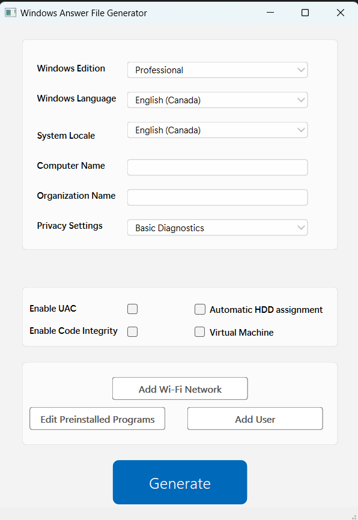

# Windows Answer File Generator


<!-- ABOUT THE PROJECT -->
## About The Project



Windows Answer File Generator is a PyQT based open-source application that helps users create Windows Answer files for an easy Windows installation.
It is meant to be a one-stop shop for everything Windows installation related. This includes creating users, installing applications
and automating the install process.


This project supports my Bsc thesis titled "Automatic Windows Operating System Installation". The thesis text can be found using the  [Handle.Net](https://hdl.handle.net/2437/339853) registry.


<!-- GETTING STARTED -->
## Getting Started

All the required packages can be installed by a script included in the repo called "PyQT_installer.py".
In case you want to install it manually, there is also a package dependency list. 

### Prerequisites

* Python 3.10+

### Installation

_Below is an example of how you can instruct your audience on installing and setting up your app. This template doesn't rely on any external dependencies or services._

1. Clone the repo
   ```sh
   git clone https://github.com/Alex591/answer-generator.git
   ```
2. Install package dependencys with the built-in script
   ```sh
   cd <GIT_LOCATION>
   python3 PyQT_installer.py
   ```
3. Run "main.py"